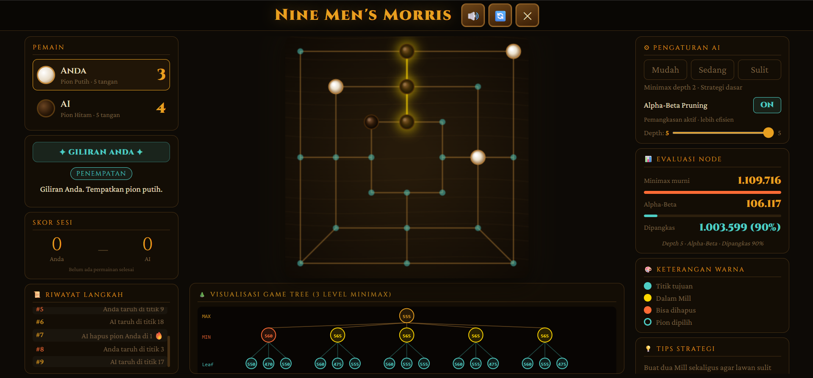

# Nine Men's Morris — Adversarial Search (AI)

> Implementasi mandiri **Minimax + Alpha-Beta Pruning** (from scratch, tanpa library)  
> Mata Kuliah Kecerdasan Buatan — S1 Teknik Informatika

## 🎮 Demo
🔗 **Live:** `https://ninemensmorris.my.id/` *(ganti setelah deploy)*  
📂 **GitHub:** `https://github.com/Alnazh/nine-mens-morris`

---

## ✅ Fitur yang Diimplementasikan

| # | Fitur | Status |
|---|-------|--------|
| 1 | Human vs AI menggunakan Minimax Algorithm | ✅ |
| 2 | Alpha-Beta Pruning sebagai optimasi Minimax | ✅ |
| 3 | Visualisasi Game Tree minimal 3 level (SVG dinamis) | ✅ |
| 4 | Counter node: Minimax murni vs Alpha-Beta | ✅ |
| 5 | Toggle mode: Minimax murni ↔ Alpha-Beta Pruning | ✅ |
| 6 | Pengaturan depth (1–5) via slider oleh pengguna | ✅ |
| 7 | Indikator giliran & status (menang/seri/kalah) | ✅ |
| 8 | Tampilan responsif (desktop & mobile) | ✅ |
| 9 | Mode Human vs Human | ✅ |

---

## 📁 Struktur File

```
nine-mens-morris/
├── index.html          # Struktur HTML & layout UI (239 baris)
├── main-interface.png  # Screenshot tampilan aplikasi
├── style.css           # Gaya visual & responsivitas (338 baris)
├── script.js           # Logika game + Minimax + Alpha-Beta (881 baris)
└── README.md           # Dokumentasi ini
```

---

## 🚀 Cara Menjalankan di Localhost

### Metode 1 — VS Code Live Server *(direkomendasikan)*
```
1. Install ekstensi "Live Server" di VS Code
2. Buka folder nine-mens-morris/ di VS Code
3. Klik kanan index.html → "Open with Live Server"
4. Browser otomatis buka http://127.0.0.1:5500
```

### Metode 2 — Python HTTP Server
```bash
cd nine-mens-morris
python -m http.server 8080
# Buka: http://localhost:8080
```

### Metode 3 — Node.js
```bash
cd nine-mens-morris
npx serve .
# Ikuti URL yang tampil di terminal
```

> ⚠️ **Jangan** buka `index.html` langsung lewat `file://` — font Google tidak akan termuat.

---

## 🧠 Algoritma yang Diimplementasikan

### Tingkat Kesulitan & Konfigurasi Minimax

| Tingkat | Depth | Strategi |
|---------|-------|----------|
| Mudah   | 1     | Minimax depth 1, agak acak |
| Sedang  | 2     | Minimax depth 2, strategi dasar |
| Sulit   | 3     | Minimax depth 3 + Alpha-Beta |

### Pseudocode Minimax + Alpha-Beta
```
function minimax(state, depth, α, β, isMaximizer):
    if depth == 0 or terminal(state):
        return evaluate(state)

    if isMaximizer:  // giliran AI
        best = -∞
        for each move in legalMoves(state):
            val = minimax(apply(move), depth-1, α, β, false)
            best = max(best, val)
            α = max(α, val)
            if β ≤ α: break  // alpha cut-off
        return best

    else:            // giliran Human
        best = +∞
        for each move in legalMoves(state):
            val = minimax(apply(move), depth-1, α, β, true)
            best = min(best, val)
            β = min(β, val)
            if β ≤ α: break  // beta cut-off
        return best
```

### Fungsi Evaluasi (Heuristik)
- **Selisih pion** (AI − Human) × 20
- **Mill terbentuk** ±500 per mill
- **Hampir mill** (2 pion + 1 kosong) ±50
- **Mobilitas** (jumlah gerakan tersedia) ±3 per gerakan

---

## 📊 Perbandingan Node (estimasi, depth 1-5)

| Depth | Minimax (node) | Alpha-Beta (node) | Efisiensi |
|-------|----------------|-------------------|-----------|
| 1     | ~9             | ~9                | 0%        |
| 2     | ~81            | ~28               | ~65%      |
| 3     | ~729           | ~95               | ~87%      |
| 4     | ~6.561         | ~380              | ~94%      |

*Angka aktual ditampilkan live di panel kanan aplikasi.*

---

## Screenshots

### Tampilan Utama

